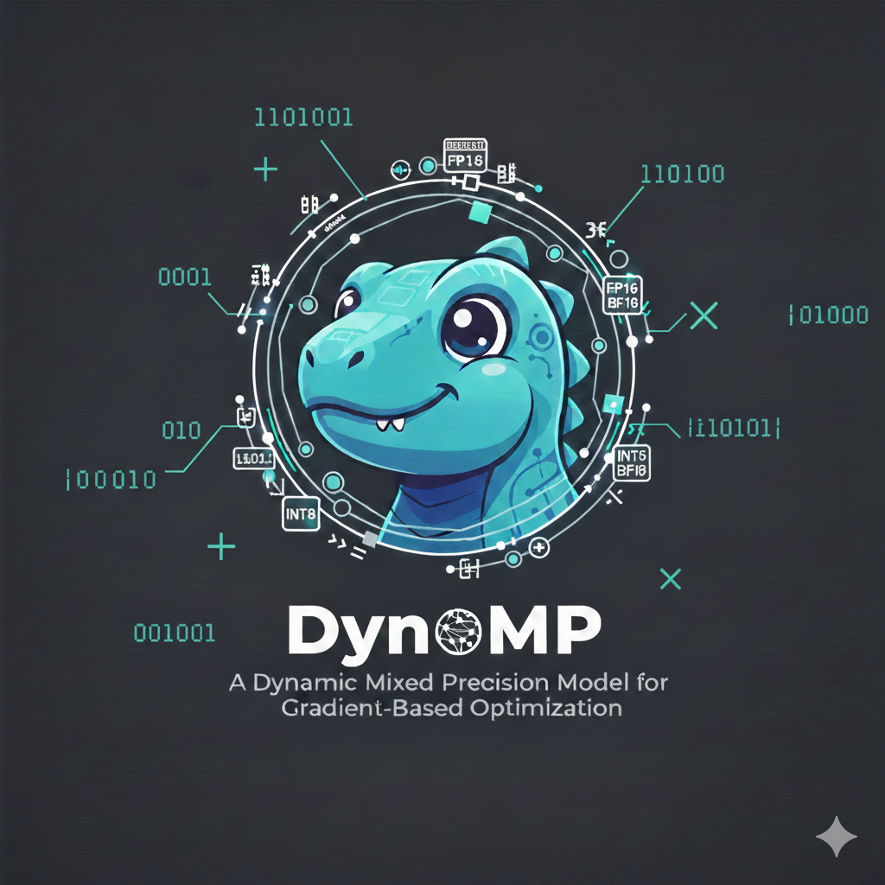

# DynoMP: Dynamic Mixed Precision Optimization
>
> **Note**: This repository contains the code and experiments for the MICCAI 2026 paper submission "DynoMP: Dynamic Mixed Precision Optimization".


This paper introduces **DynoMP**, a framework for dynamic mixed precision optimization in medical image registration. By dynamically switching between floating-point precisions during optimization, DynoMP significantly reduces memory footprint and computational time while maintaining registration accuracy comparable to full-precision baselines.
<br clear="left"/>

## 🚀 Features

- **Dynamic Precision Switching**: Automatically adjusts precision (e.g., FP32, FP16, BF16) based on optimization stability and gradients.
- **ANTs Integration**: Custom build of Advanced Normalization Tools (ANTs) with mixed-precision support.
- **Deep Learning Support**: PyTorch implementations for VoxelMorph and other learning-based registration tasks.
- **Containerized Workflow**: Fully reproducible environments using Apptainer/Singularity.

## 🛠 Prerequisites

- **Python 3.10+**
- **Apptainer (formerly Singularity)**: For running ANTs experiments.
- **DataLad**: For dataset management and retrieval.
- **Slurm**: Expected for running batch experiments (though scripts can be adapted for local execution).

## 📦 Installation

1. **Clone the repository:**

    ```bash
    git clone https://github.com/mathdugre/DynoMP.git
    cd DynoMP
    ```

2. **Install Python dependencies:**
    We use `uv` or `pip` with `pyproject.toml`.

    ```bash
    pip install .
    # OR if using uv
    uv sync
    ```

3. **Setup Environment & Data:**
    Run the setup script to download necessary datasets via DataLad and pull the required Apptainer images.

    ```bash
    bash code/setup.sh
    ```

    *This will download templates from TemplateFlow and the experimental dataset (RawDataBIDS/BMB_1) for ANTs experiments.*

## 🔬 Reproducing Experiments

### 1. ANTs Registration Experiments

To reproduce the classical registration experiments (SyN) with varying precision strategies:

```bash
bash code/experiments.sh
```

This script will:

1. Perform Brain Extraction (if not already done).
2. Run `antsRegistration` using the baseline (FP64) configuration.
3. Run `antsRegistration` using our **DynoMP** configuration.
4. Submit jobs to the Slurm scheduler.

*See `code/antsRegistration.sbatch` for job details.*

### 2. Deep Learning Experiments (VoxelMorph / MNIST)

All scripts for deep learning experiments are located in `code/pytorch-exp/`.

**Setup Data (OASIS):**
Download the OASIS 2D and 3D datasets required for VoxelMorph training:

```bash
bash code/pytorch-exp/get_data.sh
```

**Run Experiments:**

- **MNIST Classification**: Run the training script directly (includes baseline and DynoMP):

  ```bash
  bash code/pytorch-exp/mnist.sh
  ```

- **VoxelMorph Registration**: Use the provided Slurm scripts for different configurations (3D/2D, AMP, BF16, DynoMP):

  ```bash
  sbatch code/pytorch-exp/vm3d-default.sh        # Baseline FP32
  sbatch code/pytorch-exp/vm3d-dmp.sh            # DynoMP
  sbatch code/pytorch-exp/vm3d-amp.sh            # PyTorch's Automatic Mixed Precision (AMP)
  # See code/pytorch-exp/ for other variants (bf16, fp16, etc.)
  ```

### 3. Visualization & Analysis

Notebooks are provided to analyze the results and generate figures for the paper:

- `viz-ants.ipynb`: Visualization of ANTs registration performance, Jacobian determinants, and memory usage.
- `viz-pytorch.ipynb`: Training curves and accuracy metrics for PyTorch experiments.

## 📂 Project Structure

```
DynoMP/
├── code/                   # Source code and scripts
│   ├── pytorch-exp         # PyTorch specific experiments and setup.
│   ├── env.sh              # **[Action required]** Configuration for user environment
│   ├── experiments.sh      # Main entry point for ANTs experiments
│   ├── setups.sh           # Data and container setup
│   ├── antsRegistration.sbatch # Slurm job definition
│   └── ...
├── containers/             # Apptainer/Docker definitions
├── logs/                   # Experiment logs
├── models/                 # Saved PyTorch models
├── paper/                  # Paper source files (LaTeX)
└── ...
```

## 📜 Citation

If you find this code useful, please cite our paper:

```bibtex
@inproceedings{anonymized2026dynomp,
  title={DynoMP: Dynamic Mixed Precision Optimization},
  author={Anonymized},
  booktitle={Medical Image Computing and Computer Assisted Intervention -- MICCAI 2026},
  year={2026}
}
```

## 📄 License

This project is licensed under the MIT License - see the [LICENSE](LICENSE) file for details.
